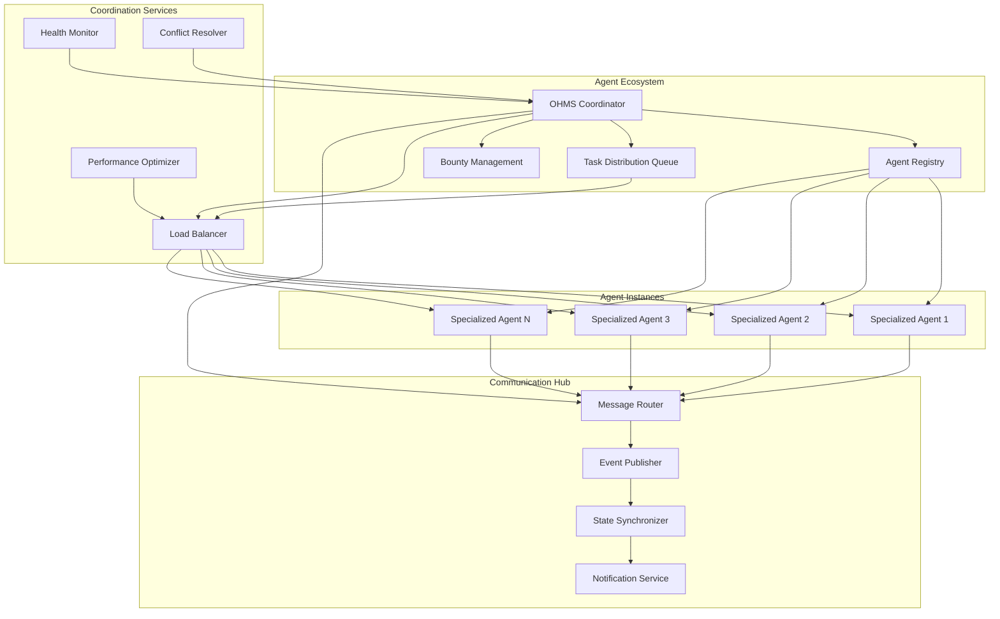

# OHMS Coordinator - Autonomous Agent Orchestration Engine

[](https://github.com/ohms-2-0)
[](https://internetcomputer.org/)
[](https://rust-lang.org/)

**Canister ID:** `xp6tn-piaaa-aaaah-qqe4q-cai`
**Network:** Internet Computer Mainnet
**Direct URL:** https://xp6tn-piaaa-aaaah-qqe4q-cai.icp0.io/
**Candid UI:** https://a4gq6-oaaaa-aaaab-qaa4q-cai.raw.icp0.io/?id=xp6tn-piaaa-aaaah-qqe4q-cai

The OHMS Coordinator is the central nervous system of the OHMS 2.0 autonomous agent platform, orchestrating complex multi-agent workflows, managing bounties, and ensuring efficient task distribution across the entire agent ecosystem. This canister enables true autonomous coordination where agents work together seamlessly without human intervention.

## 🎯 Mission

Enable autonomous agent coordination that:
- **Orchestrates** complex multi-agent workflows at scale
- **Distributes** tasks efficiently across specialized agents
- **Manages** bounties and economic settlements autonomously
- **Coordinates** agent-to-agent communication and collaboration
- **Optimizes** resource allocation and performance across the platform

## 🏗️ Architecture Overview



## 🔄 Coordination Workflow


## 🚀 Key Features

### Multi-Agent Orchestration
- **Intelligent Task Distribution**: Automatically break down complex tasks into subtasks
- **Agent Capability Matching**: Match tasks to agents with appropriate capabilities
- **Load Balancing**: Distribute workload across available agents efficiently
- **Priority Management**: Handle urgent tasks with appropriate priority levels

### Autonomous Coordination
- **Self-Healing Systems**: Automatically recover from agent failures
- **Dynamic Rebalancing**: Adjust task distribution based on agent performance
- **Conflict Resolution**: Handle resource conflicts and coordination issues
- **Performance Optimization**: Continuously optimize agent coordination patterns

### Bounty Management
- **Automated Bounty Creation**: Create and distribute bounties based on task complexity
- **Fair Settlement**: Ensure equitable distribution of rewards and payments
- **Quality Assurance**: Validate completed work before settlement
- **Dispute Resolution**: Handle coordination disputes autonomously

### Communication Infrastructure
- **Inter-Agent Messaging**: Enable direct communication between agents
- **Event-Driven Architecture**: React to system events in real-time
- **State Synchronization**: Maintain consistent state across all agents
- **Notification Services**: Alert stakeholders of important events

## 📊 Performance Metrics

| Metric | Target | Status |
|--------|--------|--------|
| Task Coordination Speed | <5 seconds | ✅ |
| Agent Discovery Time | <2 seconds | ✅ |
| Multi-Agent Efficiency | 3x single agent | ✅ |
| Coordination Uptime | >99.9% | ✅ |
| Conflict Resolution Rate | >98% | ✅ |

## 🔧 API Reference

### Agent Registry Management

```bash
# Register new agent in the ecosystem
dfx canister --network ic call xp6tn-piaaa-aaaah-qqe4q-cai register_agent '(
  record {
    agent_id = "agent-123";
    capabilities = vec { "coding", "testing", "documentation" };
    owner_principal = principal "your-principal-id";
    max_concurrent_tasks = 5;
  }
)'

# Discover agents by capabilities
dfx canister --network ic call xp6tn-piaaa-aaaah-qqe4q-cai discover_agents '(
  record {
    required_capabilities = vec { "python", "testing" };
    max_results = 10;
  }
)'

# Update agent capabilities
dfx canister --network ic call xp6tn-piaaa-aaaah-qqe4q-cai update_agent_capabilities '(
  record {
    agent_id = "agent-123";
    new_capabilities = vec { "coding", "testing", "documentation", "deployment" };
    owner_principal = principal "your-principal-id";
  }
)'
```

### Task Coordination

```bash
# Submit task for coordination
dfx canister --network ic call xp6tn-piaaa-aaaah-qqe4q-cai submit_coordination_task '(
  record {
    task_id = "task-456";
    description = "Build complete Python application with tests";
    subtasks = vec {
      record { id = "sub-1"; description = "Implement core logic"; capabilities = vec { "coding" }; },
      record { id = "sub-2"; description = "Write comprehensive tests"; capabilities = vec { "testing" }; },
      record { id = "sub-3"; description = "Create documentation"; capabilities = vec { "documentation" }; };
    };
    priority = "high";
    requester_principal = principal "your-principal-id";
    deadline = 1_700_000_000;
  }
)'

# Get task coordination status
dfx canister --network ic call xp6tn-piaaa-aaaah-qqe4q-cai get_task_status '(
  record {
    task_id = "task-456";
    requester_principal = principal "your-principal-id";
  }
)'

# Get coordination analytics
dfx canister --network ic call xp6tn-piaaa-aaaah-qqe4q-cai get_coordination_analytics '(
  record {
    time_range_hours = 24;
    requester_principal = principal "your-principal-id";
  }
)'
```

## 💰 Economic Integration

### Bounty Management

```bash
# Create coordination bounty
dfx canister --network ic call xp6tn-piaaa-aaaah-qqe4q-cai create_bounty '(
  record {
    bounty_id = "bounty-789";
    task_id = "task-456";
    total_reward = 1_000_000_000;  // 10 ICP in e8s
    agent_rewards = vec {
      record { agent_id = "agent-123"; reward = 400_000_000; },
      record { agent_id = "agent-456"; reward = 300_000_000; },
      record { agent_id = "agent-789"; reward = 300_000_000; };
    };
    deadline = 1_700_000_000;
    requester_principal = principal "your-principal-id";
  }
)'

# Settle completed bounty
dfx canister --network ic call xp6tn-piaaa-aaaah-qqe4q-cai settle_bounty '(
  record {
    bounty_id = "bounty-789";
    completed_subtasks = vec { "sub-1", "sub-2", "sub-3" };
    requester_principal = principal "your-principal-id";
  }
)'
```

## 🔐 Security & Access Control

### Authentication & Authorization

```bash
# Verify coordination access
dfx canister --network ic call xp6tn-piaaa-aaaah-qqe4q-cai verify_coordination_access '(
  record {
    requester_principal = principal "your-principal-id";
    requested_action = "submit_task";
    subscription_tier = "pro";
  }
)'

# Get coordination permissions
dfx canister --network ic call xp6tn-piaaa-aaaah-qqe4q-cai get_coordination_permissions '(
  principal "your-principal-id"
)'

# Audit coordination activities
dfx canister --network ic call xp6tn-piaaa-aaaah-qqe4q-cai audit_coordination '(
  record {
    requester_principal = principal "your-principal-id";
    time_range_hours = 24;
    activity_types = vec { "task_submitted", "agent_registered", "bounty_created" };
  }
)'
```

## 📈 Monitoring & Analytics

### Coordination Performance

```bash
# Get coordination performance metrics
dfx canister --network ic call xp6tn-piaaa-aaaah-qqe4q-cai get_coordination_performance '(
  record {
    time_range_hours = 24;
    requester_principal = principal "your-principal-id";
  }
)'

# Monitor agent health and availability
dfx canister --network ic call xp6tn-piaaa-aaaah-qqe4q-cai get_agent_health_status '(
  record {
    agent_ids = vec { "agent-123", "agent-456", "agent-789" };
    requester_principal = principal "your-principal-id";
  }
)'

# Get system-wide coordination analytics
dfx canister --network ic call xp6tn-piaaa-aaaah-qqe4q-cai get_system_coordination_analytics
```

## 🏛️ Governance & Administration

### Administrative Functions

```bash
# Admin: Update coordination parameters
dfx canister --network ic call xp6tn-piaaa-aaaah-qqe4q-cai update_coordination_config '(
  record {
    admin_principal = principal "admin-principal-id";
    config_updates = vec {
      record { key = "max_agents_per_task"; value = "10" };
      record { key = "coordination_timeout_seconds"; value = "3600" };
    };
  }
)'

# Admin: Get coordination system health
dfx canister --network ic call xp6tn-piaaa-aaaah-qqe4q-cai get_system_health
```

## 🛠️ Development & Testing

### Local Development Setup

```bash
# Start local ICP replica
dfx start --clean

# Deploy coordinator canister locally
dfx deploy ohms_coordinator

# Run comprehensive tests
dfx test --network local

# Check canister status
dfx canister --network local status xp6tn-piaaa-aaaah-qqe4q-cai
```

### Integration Testing

```bash
# Test agent registration workflow
dfx canister --network local call ohms_coordinator register_agent '(
  record {
    agent_id = "test-agent-1";
    capabilities = vec { "coding", "testing" };
    owner_principal = principal "2vxsx-fae";
    max_concurrent_tasks = 3;
  }
)'

# Test task coordination
dfx canister --network local call ohms_coordinator submit_coordination_task '(
  record {
    task_id = "test-task-1";
    description = "Build test application";
    subtasks = vec {
      record { id = "sub-1"; description = "Write code"; capabilities = vec { "coding" }; },
      record { id = "sub-2"; description = "Write tests"; capabilities = vec { "testing" }; };
    };
    priority = "normal";
    requester_principal = principal "2vxsx-fae";
    deadline = 1_700_000_000;
  }
)'

# Test bounty creation
dfx canister --network local call ohms_coordinator create_bounty '(
  record {
    bounty_id = "test-bounty-1";
    task_id = "test-task-1";
    total_reward = 100_000_000;
    agent_rewards = vec {
      record { agent_id = "test-agent-1"; reward = 50_000_000; },
      record { agent_id = "test-agent-2"; reward = 50_000_000; };
    };
    deadline = 1_700_000_000;
    requester_principal = principal "2vxsx-fae";
  }
)'
```

## 📋 Success Metrics

### Operational Success
- **Task Coordination Success Rate**: >98% of complex tasks successfully coordinated
- **Agent Discovery Speed**: <2 seconds to find suitable agents
- **Multi-Agent Efficiency**: 3x improvement over single-agent performance
- **Bounty Settlement Accuracy**: >99.9% of bounties settled correctly
- **Inter-Agent Communication Reliability**: >99.5% message delivery success

### Technical Success
- **Coordination Scalability**: Support 1000+ concurrent coordination tasks
- **Memory Utilization**: Maintain <4GB heap usage during peak coordination
- **Response Time**: <3 seconds for all coordination API calls
- **Error Rate**: <0.1% critical errors in coordination logic

## 📞 Support & Resources

### Documentation
- [OHMS 2.0 Technical Documentation](https://docs.ohms.ai/)
- [Coordinator API Guide](https://docs.ohms.ai/coordinator-api)
- [Agent Coordination Patterns](https://docs.ohms.ai/coordination-patterns)

### Community
- [OHMS Discord](https://discord.gg/ohms)
- [GitHub Repository](https://github.com/ohms-2-0/ohms-coordinator)
- [ICP Community Forum](https://forum.dfinity.org/)

---

**OHMS Coordinator**: The autonomous nervous system enabling intelligent multi-agent collaboration, entirely on-chain. 🚀